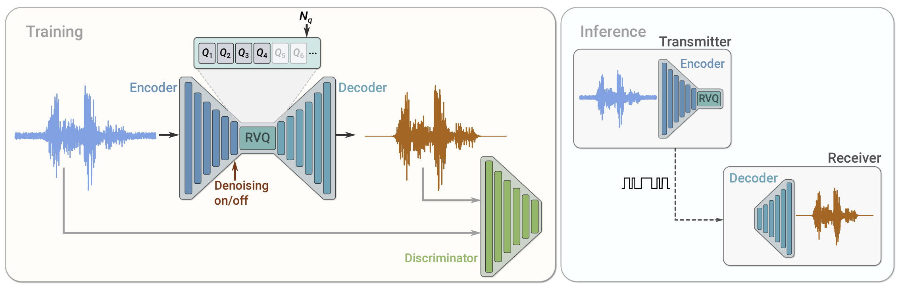

# SoundStream - PyTorch
Implementation of [SoundStream](https://arxiv.org/abs/2107.03312), an end-to-end neural audio codec



- 🔊 Implements SoundStream model inference
- 🎛️ Works with 27M parameter [model](https://huggingface.co/haydenshively/SoundStream/) pretrained on 10k hours of English speech ([Multilingual LibriSpeech](https://www.openslr.org/94/) dataset)

## Install
```bash
pip install soundstream
```

## Usage

> **Note**
> The pretrained model is configured as specified in [NaturalSpeech 2](https://arxiv.org/abs/2304.09116), so it has different channels/strides than the original SoundStream.

```Python
import torchaudio

from soundstream import from_pretrained, load


waveform = load('in.wav')
audio_codec = from_pretrained()  # downloads model from Hugging Face

quantized = audio_codec(waveform, mode='encode')
recovered = audio_codec(quantized, mode='decode')

torchaudio.save('out.wav', recovered[0], 16000)
```

## Citations

### Code

- https://github.com/descriptinc/melgan-neurips
- https://github.com/lucidrains/audiolm-pytorch
- https://github.com/wesbz/SoundStream

### Papers

```bibtex
@misc{zeghidour2021soundstream,
      title={SoundStream: An End-to-End Neural Audio Codec}, 
      author={Neil Zeghidour and Alejandro Luebs and Ahmed Omran and Jan Skoglund and Marco Tagliasacchi},
      year={2021},
      eprint={2107.03312},
      archivePrefix={arXiv},
      primaryClass={cs.SD}
}
```

```bibtex
@misc{kumar2019melgan,
      title={MelGAN: Generative Adversarial Networks for Conditional Waveform Synthesis}, 
      author={Kundan Kumar and Rithesh Kumar and Thibault de Boissiere and Lucas Gestin and Wei Zhen Teoh and Jose Sotelo and Alexandre de Brebisson and Yoshua Bengio and Aaron Courville},
      year={2019},
      eprint={1910.06711},
      archivePrefix={arXiv},
      primaryClass={eess.AS}
}
```

```bibtex
@misc{tagliasacchi2020seanet,
      title={SEANet: A Multi-modal Speech Enhancement Network}, 
      author={Marco Tagliasacchi and Yunpeng Li and Karolis Misiunas and Dominik Roblek},
      year={2020},
      eprint={2009.02095},
      archivePrefix={arXiv},
      primaryClass={eess.AS}
}
```

```bibtex
@misc{shen2023naturalspeech,
      title={NaturalSpeech 2: Latent Diffusion Models are Natural and Zero-Shot Speech and Singing Synthesizers}, 
      author={Kai Shen and Zeqian Ju and Xu Tan and Yanqing Liu and Yichong Leng and Lei He and Tao Qin and Sheng Zhao and Jiang Bian},
      year={2023},
      eprint={2304.09116},
      archivePrefix={arXiv},
      primaryClass={eess.AS}
}
```